# 常见蜜罐体验和探索

## 实验目的
* 了解蜜罐的分类和基本原理
* 了解不同类型蜜罐的适用场合
* 掌握常见蜜罐的搭建和使用

## 实验环境   
* 从 paralax/awesome-honeypots中选择 1 种低交互蜜罐和 1 种中等交互蜜罐进行搭建实验
  * 推荐 SSH 蜜罐

## 实验要求
* 记录蜜罐的详细搭建过程；
* 使用 nmap 扫描搭建好的蜜罐并分析扫描结果，同时分析「 nmap 扫描期间」蜜罐上记录得到的信息；
* 如何辨别当前目标是一个「蜜罐」？以自己搭建的蜜罐为例进行说明；

## 实验过程 
### 实验拓扑结构   
  * 在Kali-victim1环境中搭建蜜罐，attacker攻击victim1
    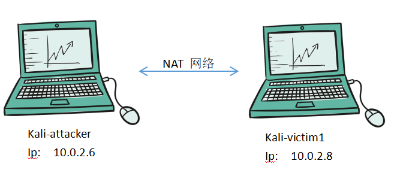      
  * 网络设置   
    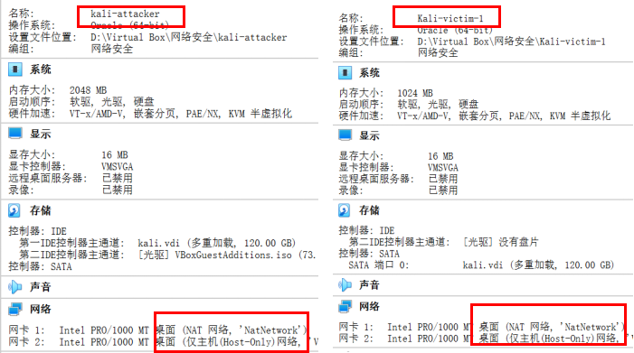       
  * 网络测试 
    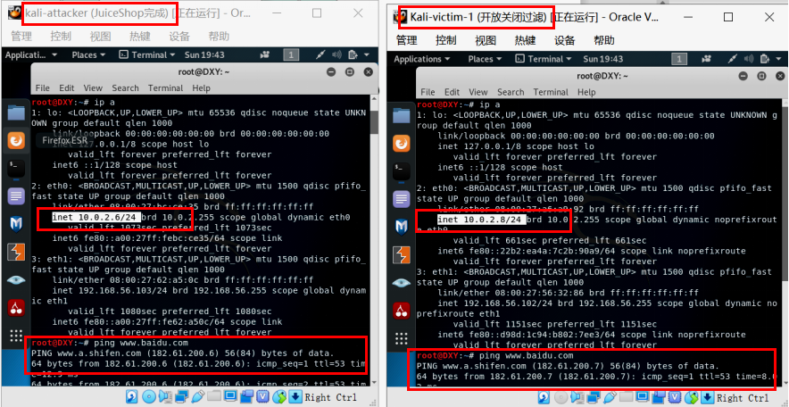  
### 基础理解
* 蜜罐技术本质上是一种对攻击方进行欺骗的技术，通过布置一些作为诱饵的主机、网络服务或者信息，诱使攻击方对它们实施攻击，从而可以对攻击行为进行捕获和分析，了解攻击方所使用的工具与方法，推测攻击意图和动机，能够让防御方清晰地了解他们所面对的安全威胁，并通过技术和管理手段来增强实际系统的安全防护能力。
* 蜜罐好比是情报收集系统。蜜罐好像是故意让人攻击的目标，引诱黑客前来攻击。所以攻击者入侵后，你就可以知道他是如何得逞的，随时了解针对服务器发动的最新的攻击和漏洞。还可以通过窃听黑客之间的联系，收集黑客所用的种种工具，并且掌握他们的社交网络。

### 蜜罐搭建
* 低交互蜜罐ssh-Honeypot的搭建
  * 从[paralax/awesome-honeypots](https://github.com/paralax/awesome-honeypots#honeypots)中选择低交互蜜罐[ssh-honeypot](https://github.com/droberson/ssh-honeypot)  
  * 用git clone文件到victim1本地     
    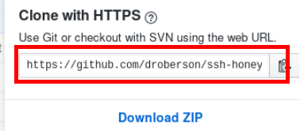       
    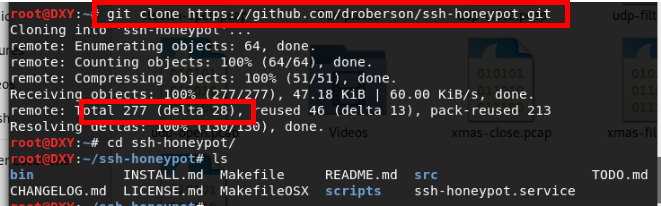      
  * 默认22端口给蜜罐使用，编辑配置文件将ssh的端口号改为一个不常用的端口号56，让出22端口位置     
    * vi /etc/ssh/sshd_config        
    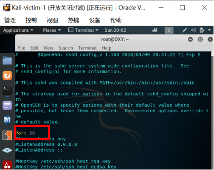     
  * 重启ssh服务    
    * service ssh restart    
  * 安装docker服务并启动    
    * apt-get install docker docker-compose      
    * service docker start    
      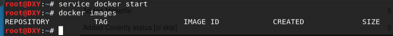    
  * 搭建蜜罐（步骤在[readme.md](https://github.com/droberson/ssh-honeypot)中）    
    * Make sure libssh and libjson-c are installed    
      * apt install libssh-dev libjson-c-dev   
    * Build and Run
      * make
      * ssh-keygen -t rsa -f ./ssh-honeypot.rsa
      * bin/ssh-honeypot -r ./ssh-honeypot.rsa       
  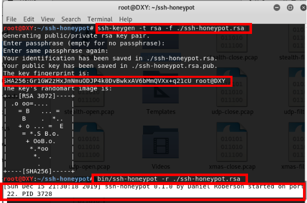  
    * ssh-honeypot 搭建成功      
* 中等交互蜜罐cowrie蜜罐的搭建    
  * 从[paralax/awesome-honeypots](https://github.com/paralax/awesome-honeypots#honeypots)中选择中等交互蜜罐[cowrie](https://github.com/cowrie/cowrie)     
  * 用git clone文件到victim1本地            
    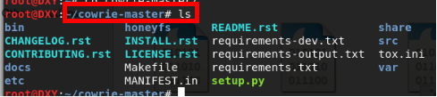   
  * 启动docker，下载镜像    
    * docker pull cowrie/cowrie     
    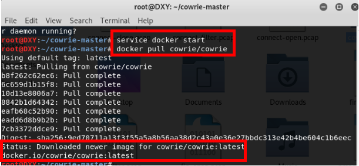    
  * 成功运行，cowrie蜜罐搭建成功 （在端口2222开启）   
    * docker run -p 2222:2222 cowrie/cowrie     
      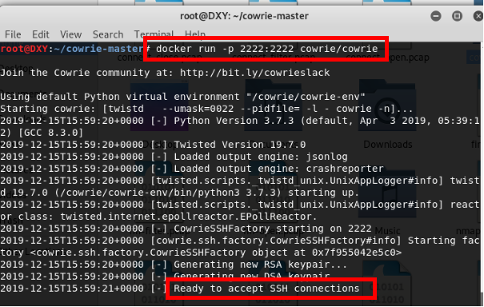

### 使用nmap扫描搭建好的蜜罐并分析扫描结果
* 扫描ssh-Honeypot蜜罐 
  * 攻击者attacker主机尝试和victim1进行ssh连接  
    （victim1的IP地址是10.0.2.8）  
    * 观察到输入的测试密码显示在运行蜜罐的victim1界面    
    * 不论attacker输入的密码正确与否，victim1都会拒绝ssh的链接，都会显示 Permission denied,please try again.  
      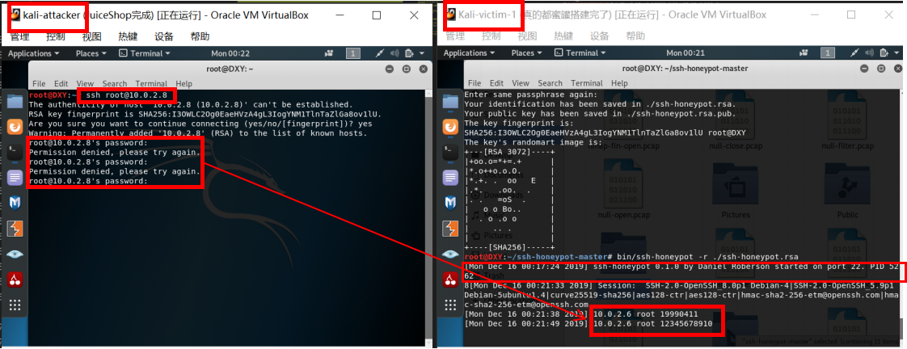  
    * 原因是ssh-honeypot是一个低交互式的蜜罐，无法完成ssh连接。
    * 日志能记录攻击者行为  
      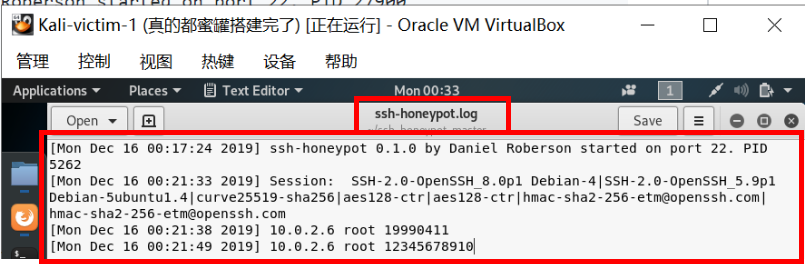 
  * 攻击者使用TCP stealth scan、XMAS scan、FIN scan、NULL scan
    * TCP stealth scan  
      收到syn-ack，说明端口为打开状态     
      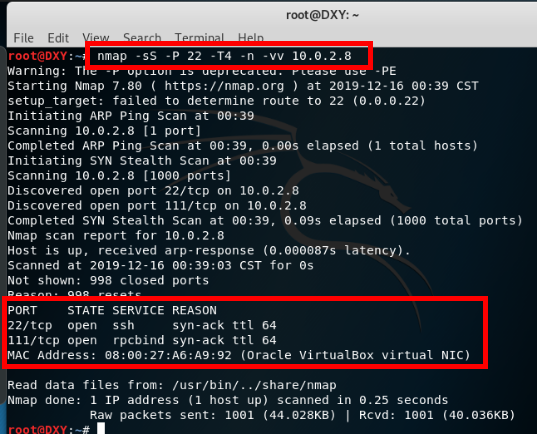  
    * XMAS scan   
      22端口、111端口为打开或过滤状态    
      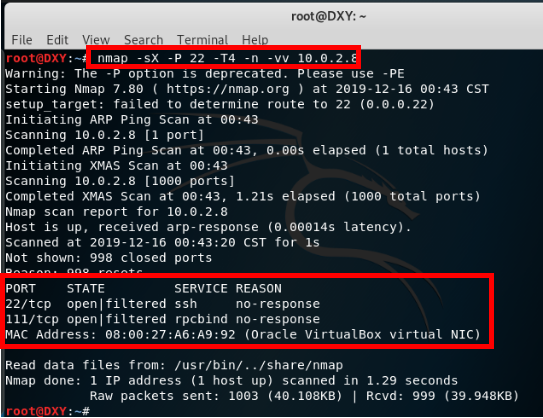   
    * FIN scan    
      22端口、111端口为打开或过滤状态  
      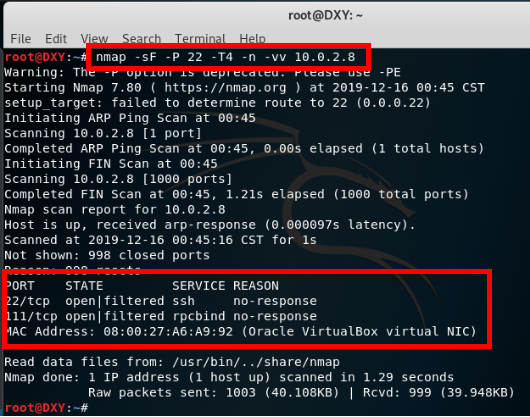  
    * Null scan  
      22端口、111端口为打开或过滤状态    
      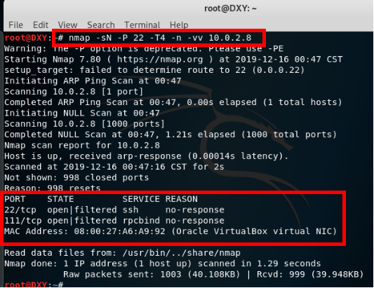  
    * 但查看日志，并未发现有新的攻击者行为记录
      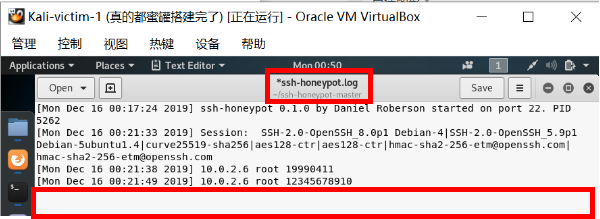
  * 因此，ssh-Honeypot作为低交互式蜜罐，仅仅是一个可以简单记录ssh连接请求数据的简易蜜罐，TCP stealth scan、XMAS scan、FIN scan、NULL scan等攻击不会被捕获。
  
* 扫描cowrie蜜罐
  * 攻击者attacker主机尝试和victim1进行ssh连接   
    （victim1的IP地址是10.0.2.8）
    * 在victim1上用```docker run -p 2222:2222 cowrie/cowrie``` 将蜜罐运行在2222端口  
    * attacker用```ssh root@10.0.2.8 -p 2222```请求和victim1进行ssh连接
    * 观察到攻击者的ip地址等信息也显示在victim1的界面上了
      * 输入密码错误时连接失败
      * 输入密码成功后连接成功
      * 连接一段时间后自动断开，可能是该蜜罐有设置连接的时间限制
    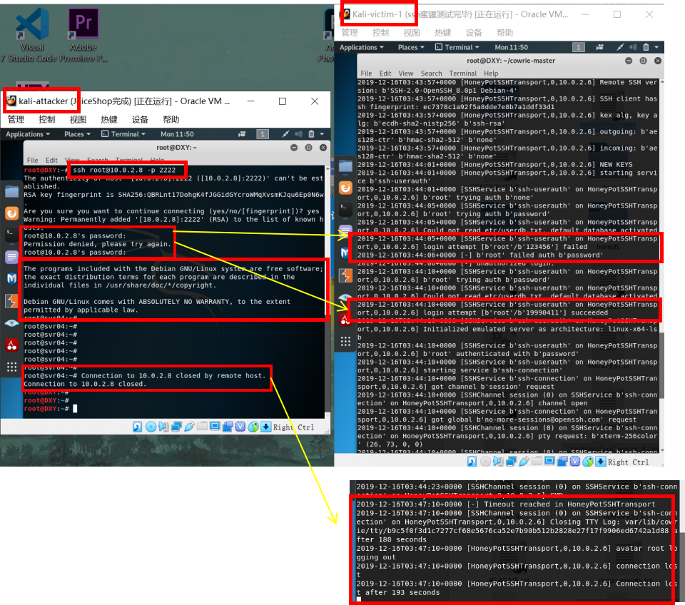  
  * 攻击者attacker 在连接了ssh后，进行ping百度的操作
    * 发现操作成功，且在victim1能看到操作记录
      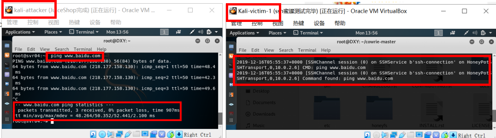
  * 攻击者attacker 在连接了ssh后，进行```curl www.baidu.com```  
    * 观察到报了错，且是'NoneType' object has no attribute 'strip'---一个python的报错。所以暴露了这是一个python的蜜罐。
      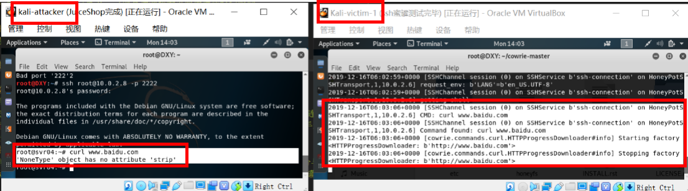
  * 攻击者使用TCP stealth scan、XMAS scan、FIN scan、NULL scan
    * TCP stealth scan  
      * 检测被蜜罐记录，记录了attacker的主机ip、端口号、session等信息 
      * 收到syn-ack，说明端口为打开状态    
        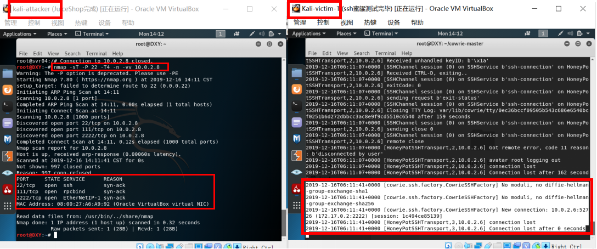
    * XMAS scan   
      * victim1主机界面没有变化，attacker的扫描没有被记录
      * 22端口、111端口为打开或过滤状态     
      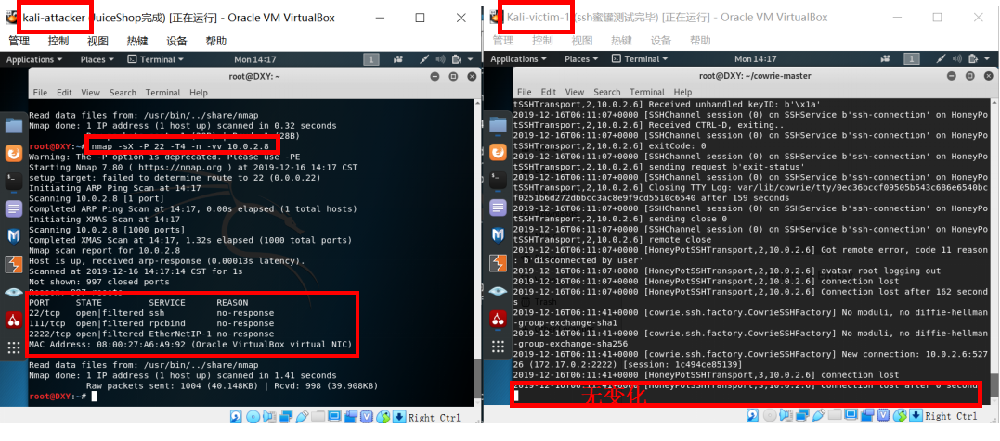   
    * FIN scan    
      * victim1主机界面没有变化，attacker的扫描没有被记录
      * 22端口、111端口为打开或过滤状态  
      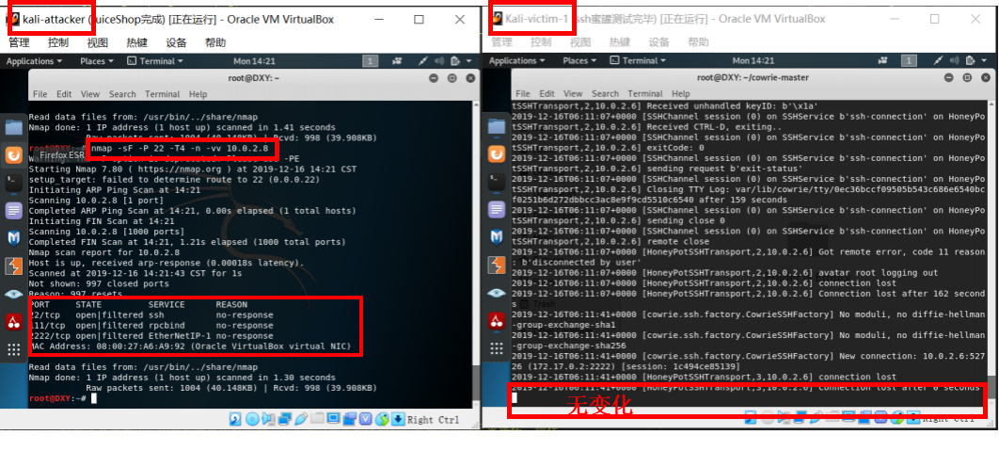  
    * Null scan  
      * victim1主机界面没有变化，attacker的扫描没有被记录
      * 22端口、111端口为打开或过滤状态    
      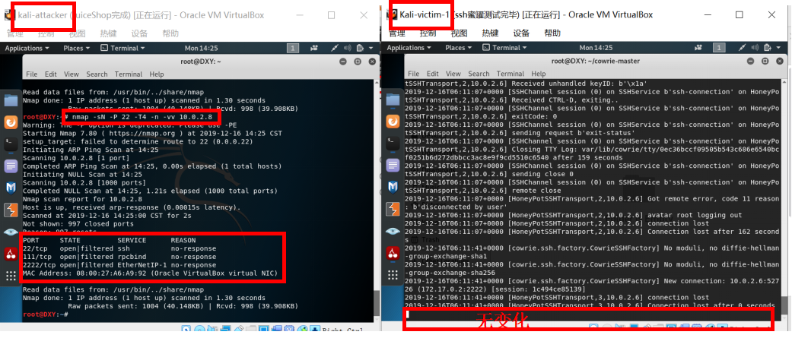  
  * cowrie是一个中等交互蜜罐，可以进行ssh远程连接等真机的操作，TCP stealth sca攻击会被记录，XMAS scan、FIN scan、NULL scan等攻击不会被记录，这个蜜罐提供的命令、错误提示等比较全面，但部分命令的错误输出会暴露这是个 python 蜜罐。

### 实验问题
* 如何辨别当前目标是一个「蜜罐」？
  从以上实验可以总结：
  * 进行ssh连接尝试，若无论密码正确与否都不能连接，则很可能暴露其是低交互蜜罐
  * 从连接ssh的自动断开时间也可以看出一些端倪
  * 观察一些指令的报错信息，可能可以判断出蜜罐的存在
* 总结常见的蜜罐识别和检测方法：
    * 低交互蜜罐是不能够给敌人提供一个完整的操作系统环境的，所以可以通过使用一些复杂的命令和操作，以及一些想不到的输出解决来检查是不是处在蜜罐环境中。
    * 另外一种情况就是出现了配置失真，也就是说在一台机器上出现了两种不同平台的服务，举个例子：运行一个Windows的Web服务器同时运行了一个Linux的FTP服务器，这样的话就出现了配置失真。使用nmap -sV这个方法可以来观察开启的服务，如果发现了平台与服务不匹配的，说明这很有可能就是一个蜜罐。
    * 资源抢夺：与低交互蜜罐检测最主要的方式是通过网络，这样就意味着低交互蜜罐是运行在一个具有正常操作系统中的，只要是在操作系统中，不可能把所有的资源都分配给蜜罐，所以如果在蜜罐中执行一个很繁琐很耗资源的操作，蜜罐就会和其他服务进程去争抢资源，最直观的感受就是蜜罐的反应速度会慢下来。但是我们通常不具备这个权限来访问这种类型的服务或者是进程，所以我们必须得考虑从网络通信入手，增加蜜罐的操作负载，如果换一个角度想，可不可以让其他的服务去和蜜罐争抢资源，来拖慢蜜罐的反应速度，举个例子比如说如果蜜罐系统和一个web服务器同时运行在一台机器上，我们可以从web服务器入手，去给web服务器发送大量http请求，导致web服务器抢占大量计算机资源用来处理请求。这样就会让蜜罐的反应慢下来。


## 参考文献
* Awesome Honeypots： https://github.com/paralax/awesome-honeypots
* SSH Honeypot： https://github.com/droberson/ssh-honeypot  
* Cowrie： https://github.com/cowrie/cowrie
* 如何判断是不是进入了蜜罐？http://tieba.baidu.com/p/5475412463