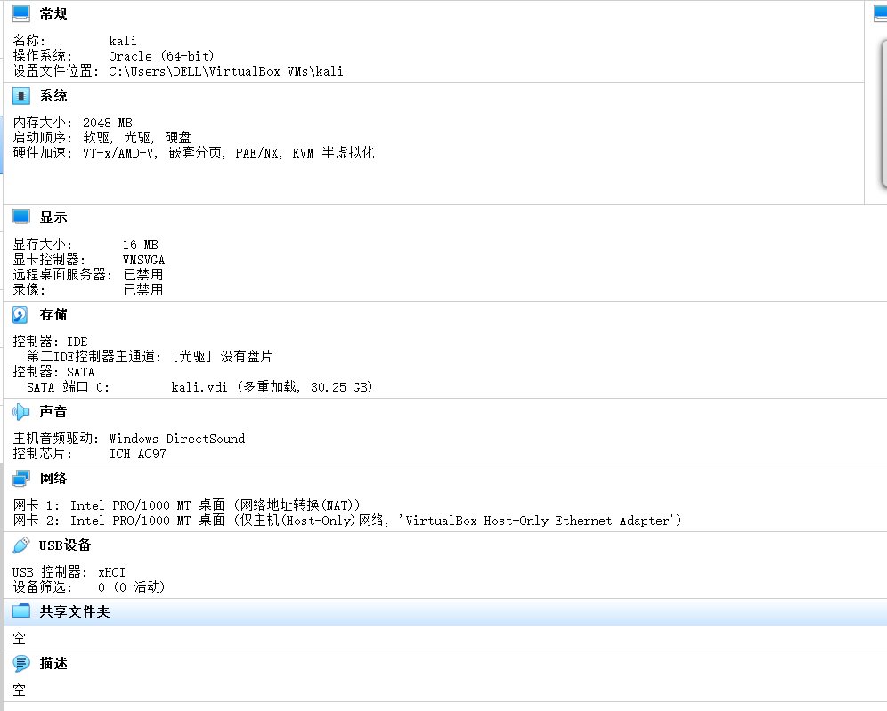
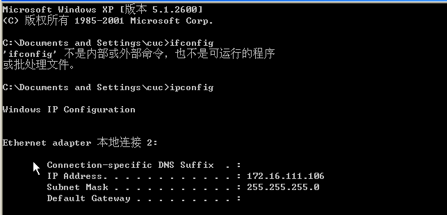
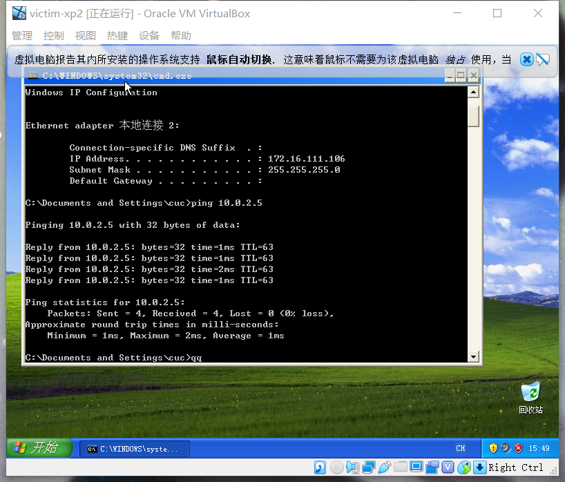

# 基于 VirtualBox 的网络攻防基础环境搭建
## 实验目的
- 掌握 VirtualBox 虚拟机的安装与使用
- 掌握 VirtualBox 的虚拟网络类型和按需配置
- 掌握 VirtualBox 的虚拟硬盘多重加载
## 实验环境
- VirtualBox 虚拟机
- 攻击者主机（Attacker）：Kali Rolling 2109.2
- 网关（Gateway, GW）：Debian Buster
- 靶机（Victim）：xp-sp3 
## 实验连通性测试完成情况
- [√] 靶机可以直接访问攻击者主机
- [√] 攻击者主机无法直接访问靶机
- [√] 网关可以直接访问攻击者主机和靶机
- [√] 靶机的所有对外上下行流量必须经过网关  
- [√] 所有节点均可以访问互联网
## 实验步骤
### 虚拟机的多重加载
- 新建名为kali的虚拟机并设置双网卡为NAT和HOST-ONLY网络
- 将下载的kali.iso镜像挂载然后按照视频要求进行安装操作
- 左上角管理-虚拟介质管理，找到kali.vdi进行释放，然后属性选择多重加载，点击应用

- 设置-存储-控制器：SATA将kali.vdi挂载

 

 - 多重加载完成

 

 - 通过多重加载，不仅可以有多个加载点，而且还可以将虚拟镜像文件和加载点文件复制到其他电脑里直接创建一个虚拟机（前提是那台机器也安装了virtualbox），不用再一次安装系统

 - 直接新建虚拟机-使用已有的虚拟硬盘文件就可以直接进入已经安装好的kali而不需要再次安装

 ### 攻防搭建所需虚拟机配置
- Attacker（Kali Rolling 2109.2）：  
网卡1：NAT网络 eth0:10.0.2.5  

- Gateway（Debian Buster）：  
网卡1：NAT网络 ip:10.0.2.15  
网卡2：HOET-ONLY网络 ip：192.168.56.113  
网卡3：内部网络 intnet1 ip:172.16.111.1  
网卡4：内部网络 intnet2 ip:172.16.222.1

- Victim（xp-sp3）：  
网卡1：内部网络 intnet2 ip:172.16.222.126

 Victim2（xp-sp3）:  
 网卡1：内部网络 intnet1 ip：172.16.111.106

### 靶机可以直接访问攻击者主机
- Ping是Windows、Unix和Linux系统下的一个命令。ping也属于一个通信协议，是TCP/IP协议的一部分。利用“ping”命令可以检查网络是否连通,再通过tcpdump -i命令查看是否接收发送的包

- 从图中可以看出，用靶机去ping攻击者的ip，ping通，即靶机可以直接访问攻击者主机

### 攻击者主机无法直接访问靶机

- 当攻击者去ping靶机的ip时，一段时间后按ctl+c发现百分比的包丢失，即无法ping通，无法直接访问

### 网关可以直接访问攻击者主机和靶机
 
 
 

 - Gateway（Debian Buster）ping攻击者主机和靶机均可ping通

 ### 靶机的所有对外上下行流量必须经过网关
 - tcpdump是一个用于截取网络分组，并输出分组内容的工具  
 通过tcpdump -i  enp0s10  -n 指令抓取所有经过该端口的网络数据，-i 指定监听的网络接口，-n 不把网络地址转换成名字
 

 - 从图中可以看出靶机victim—XP在上网时上下流量均经过网关

 ### 所有节点均可以访问互联网

 - Attacker（Kali Rolling 2109.2）：   
 

·

  -  Gateway（Debian Buster）：

   

   - Victim（xp-sp3）：

   

   -  Victim2（xp-sp3）:  

   

   ## 实验中遇到的问题
   - kali安装成功后退出再进入发现又要重新安装，查阅资料后发现在设置 - > 存储 - > 控制器:IDE 中添加了安装kali的iso文件导致在重启kali系统的时候，启动的是kali的安装iso文件，所以才会出现图中的安装kali系统的界面。启动时以镜像文件启动了
   - Gateway网卡设置不对，未能正确分配IP地址，最后添加HOST-ONLY网卡使得问题解决
   - 网关访问靶机时没有包发送和接收，在关闭XP的防火墙后问题解决